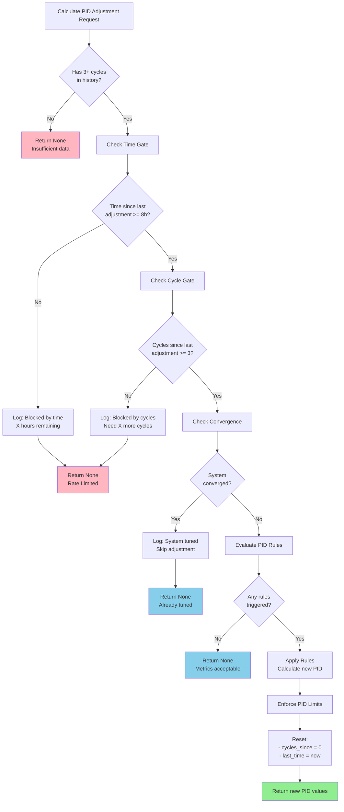
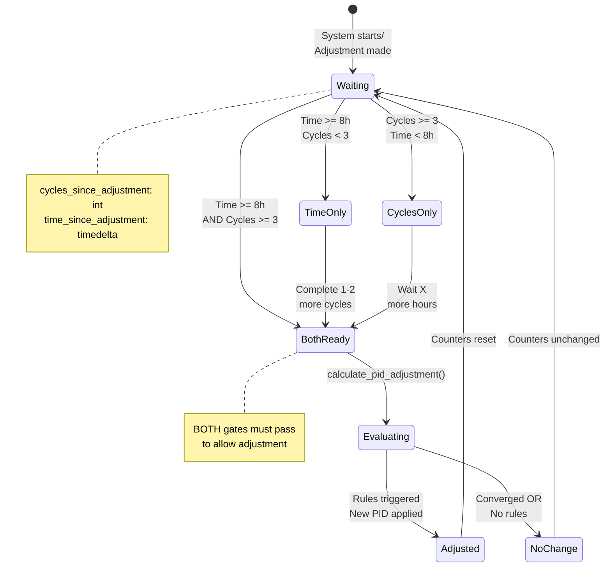
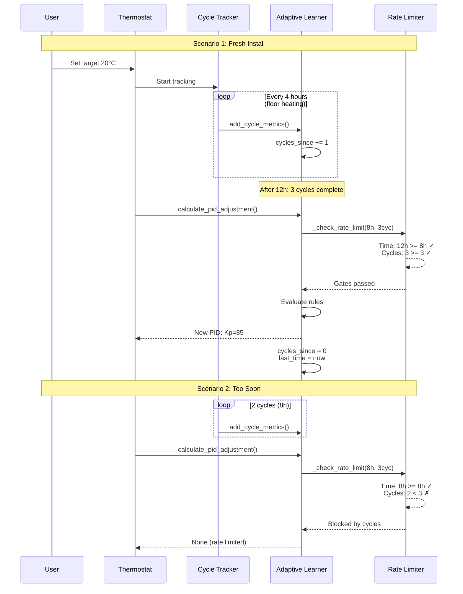
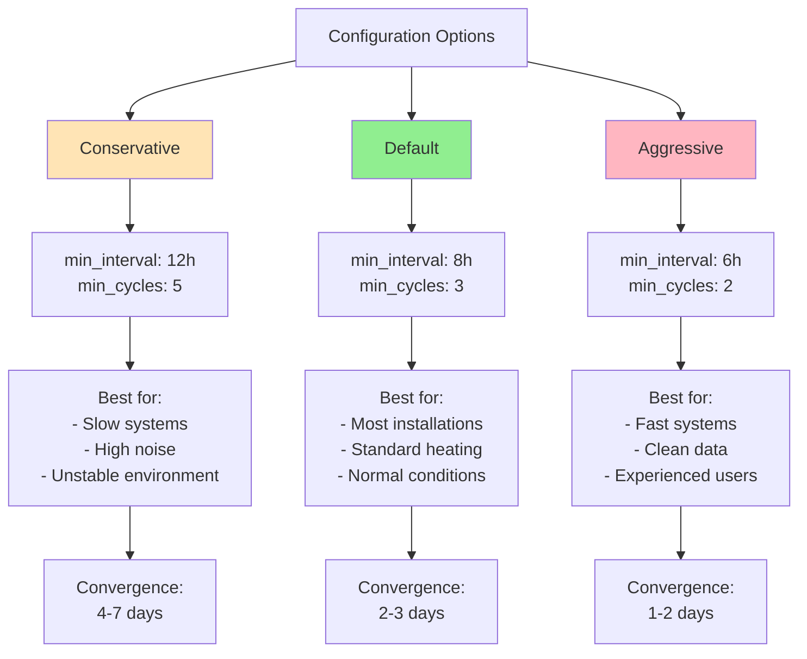
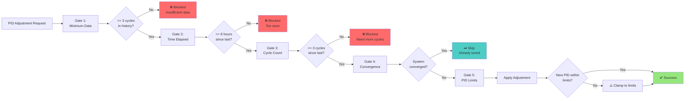
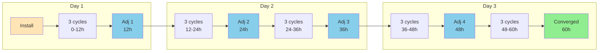
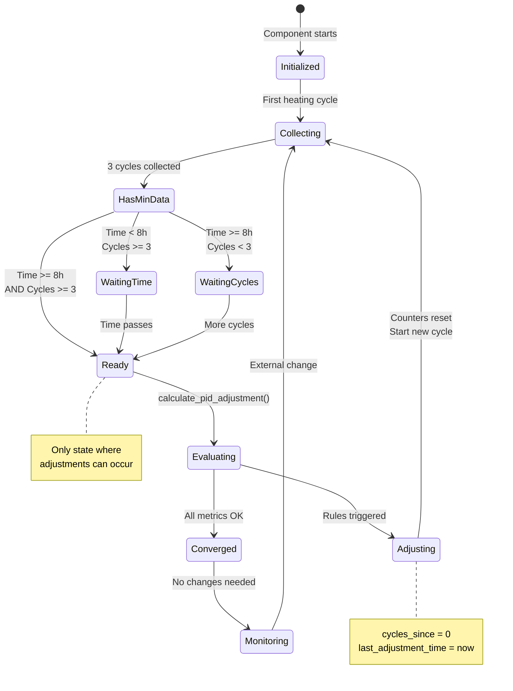

# Hybrid Rate Limiting Visual Documentation

## Decision Flow Diagram



## Time + Cycle Gate States



## Timeline Comparison: Old vs New

```mermaid
gantt
    title PID Adjustment Timeline: 24h Wall Clock vs 8h Hybrid
    dateFormat HH:mm
    axisFormat %H:%M

    section Old (24h)
    Install           :milestone, m1, 00:00, 0h
    3 cycles (12h)    :done, old1, 00:00, 12h
    Wait...           :crit, old2, 12:00, 12h
    Adjustment 1      :milestone, m2, 24:00, 0h
    3 cycles (12h)    :done, old3, 24:00, 12h
    Wait...           :crit, old4, 36:00, 12h

    section New (8h+3cyc)
    Install           :milestone, m3, 00:00, 0h
    3 cycles (12h)    :done, new1, 00:00, 12h
    Adjustment 1      :milestone, m4, 12:00, 0h
    3 cycles (12h)    :done, new2, 12:00, 12h
    Adjustment 2      :milestone, m5, 24:00, 0h
    3 cycles (12h)    :done, new3, 24:00, 12h
    Adjustment 3      :milestone, m6, 36:00, 0h
```

**Key Insight**: In 48 hours, old system makes 2 adjustments, new system makes 4 adjustments (2x faster).

## Example Scenarios



## Configuration Impact Matrix



## Safety Gates Visualization



## Convergence Timeline Projection



**Projected Timeline for Floor Hydronic (4h cycles)**:
- Install → First Adjustment: 12 hours (3 cycles)
- First → Second: 12 hours (3 cycles + 8h time gate)
- Second → Third: 12 hours
- Third → Converged: ~12-24 hours
- **Total: 2.5-3 days** (vs 14 days with 24h interval)

## Rate Limiting State Machine


