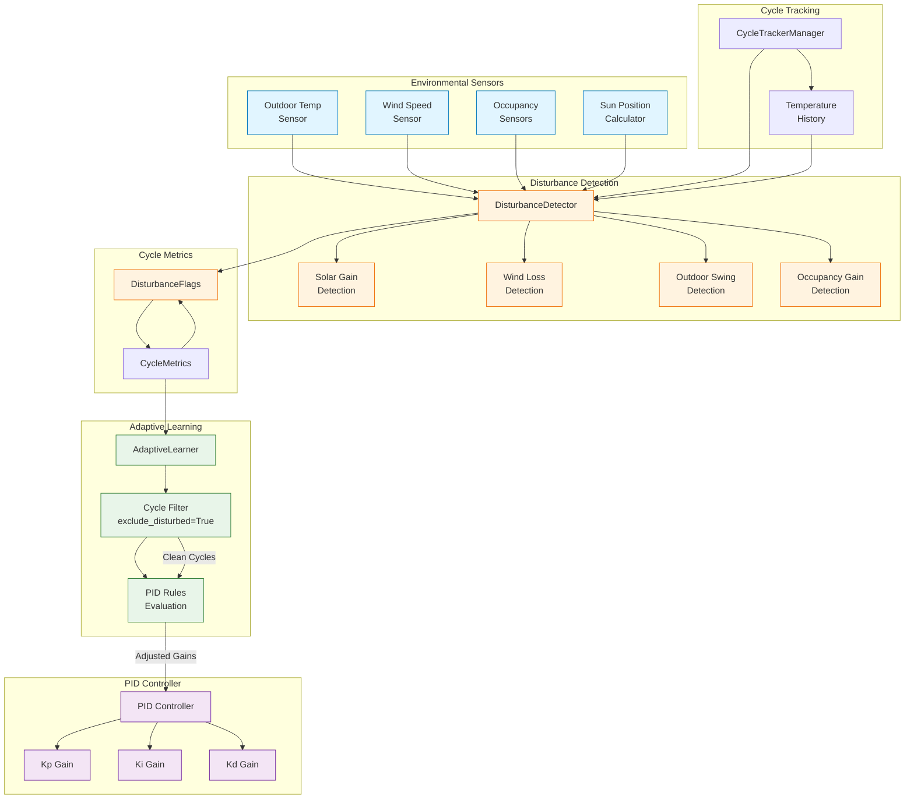
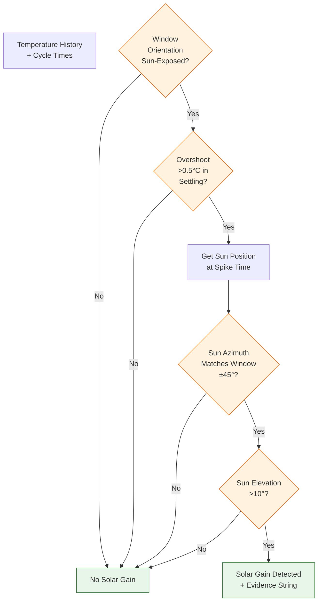
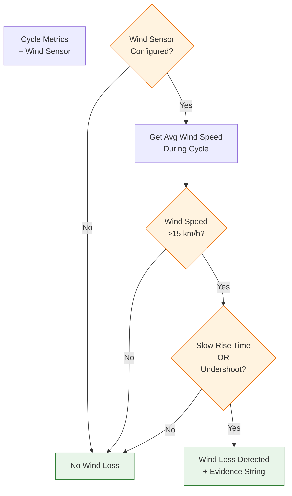
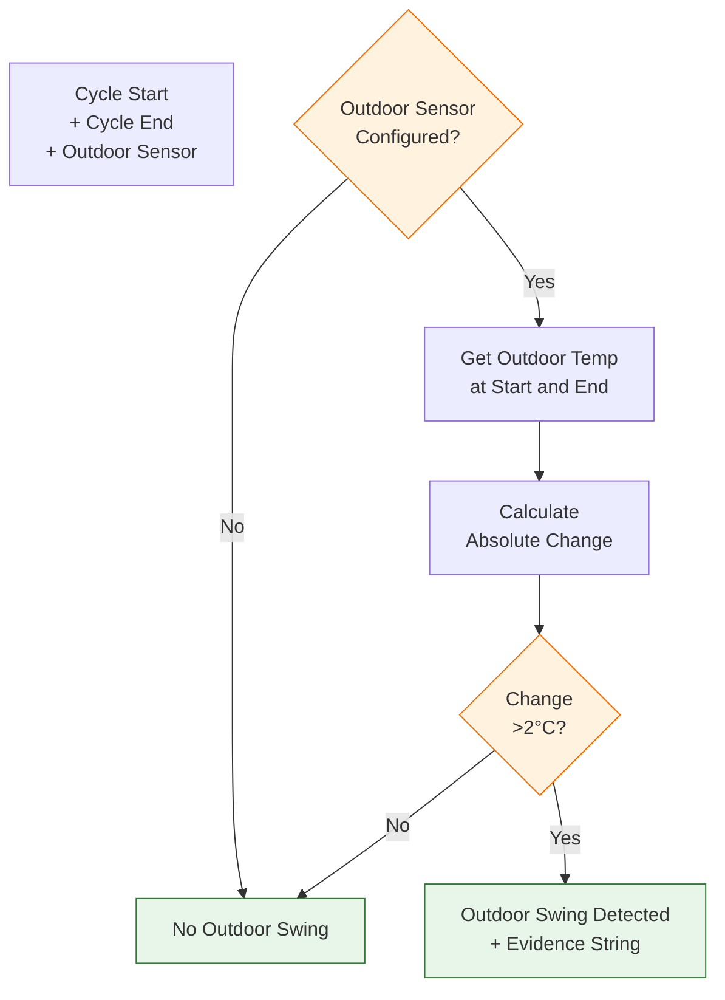
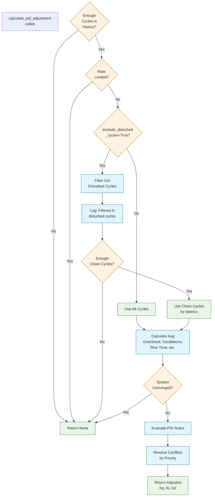
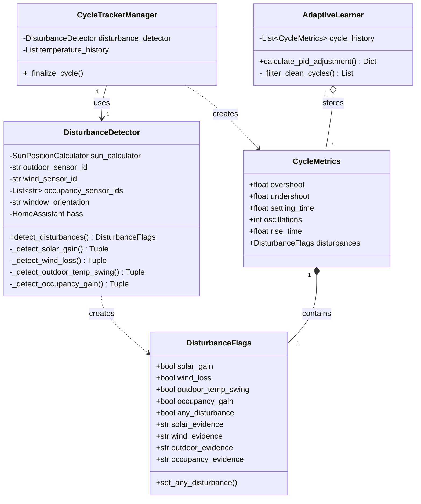
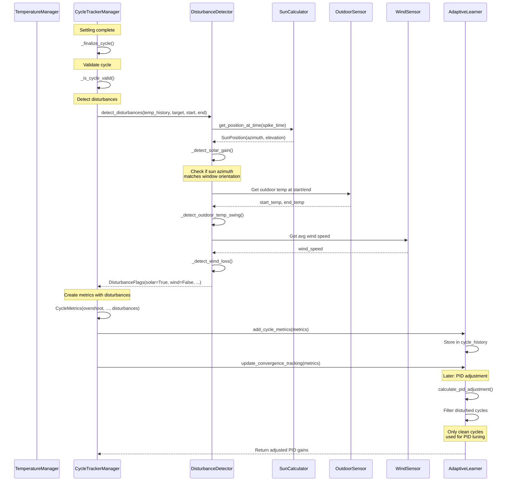
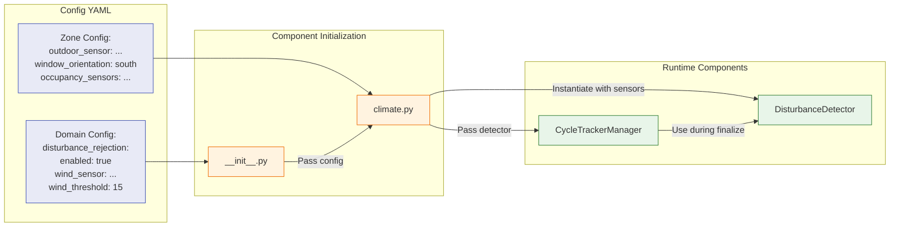
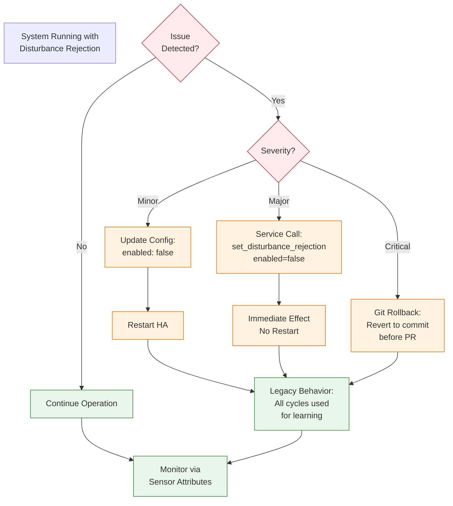
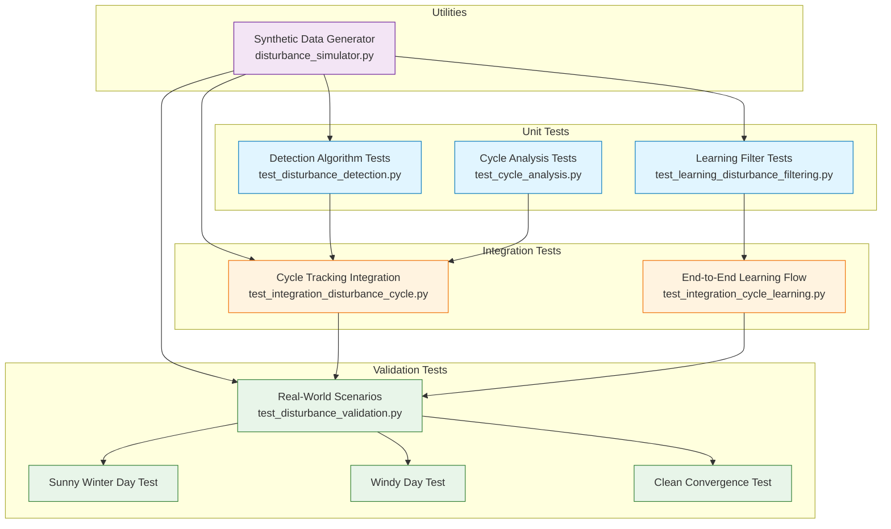

# Disturbance Rejection Architecture

## System Overview

## Detection Algorithm Flow

### Solar Gain Detection

### Wind Loss Detection

### Outdoor Temperature Swing Detection

## Learning Filter Flow

### Cycle Filtering for PID Adjustment

## Data Model Relationships

## Sequence Diagram: Cycle Completion with Disturbance Detection

## Configuration Flow

## Rollback Safety

## Testing Strategy Layers

